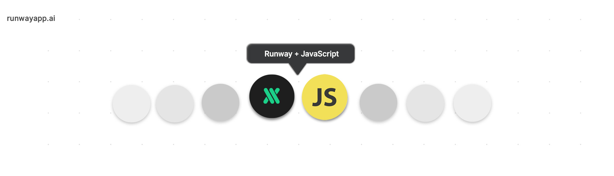

  

# Runway + JavaScript

A collection of examples and tutorials on how to use [Runway](https://runwayml.com/) with JavaScript applications.

More RunwayML networking examples [here](https://learn.runwayml.com/#/networking/examples).

🎉Community Contribution

## Examples
- [Generate Text from Webcam Images with im2txt](/im2txt/sendWebcam)
- [Receive Text from im2txt](/im2txt/receivesOnly)
- [Noise2D Image Synthesizer using SPADE-COCO](/SPADE-COCO/Noise2DSynth) by [JP Yepez](https://www.jpyepez.com) 🎉 

## Library

This will soon become a JavaScript library that manages the connections and data streams with a simple API. 

## Contributing

This is still a work in progress. Contributions are welcomed!

