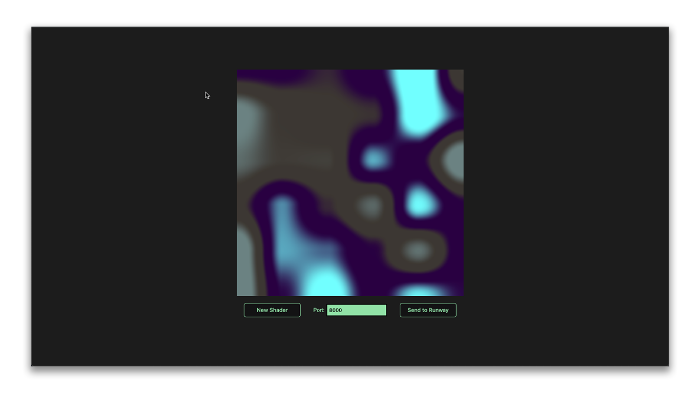
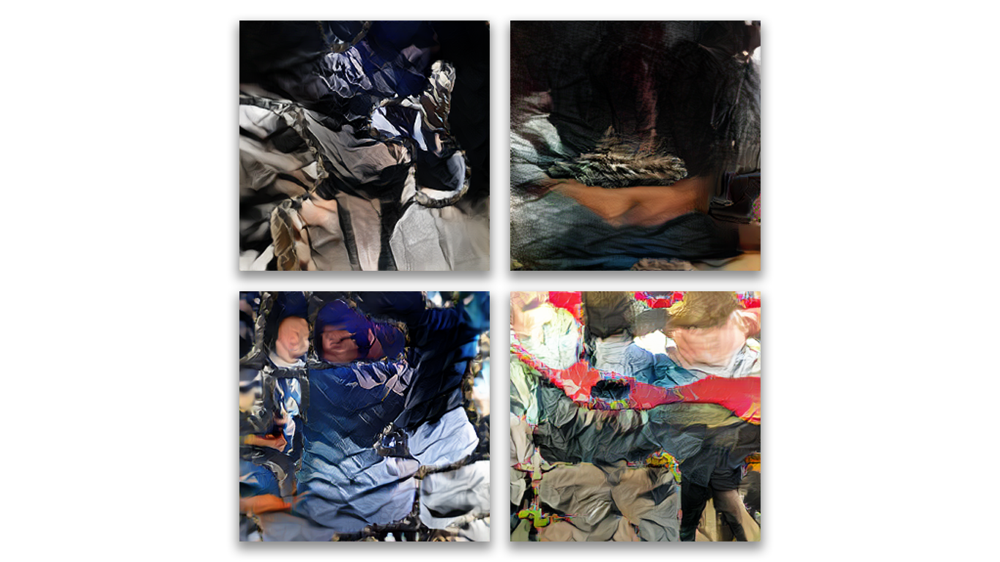

# Noise2D Image Synthesizer

### Running the Example
* Open Runway and create a workspace with the `SPADE-COCO` model. 
* Select `Preview` as an output and run the model. Check the [docs](https://learn.runwayml.com/#/) for tutorials and additional information.
* Click on `Network` on the right side of the screen to view the HTTP server address and port.
* Download the example folder and open the HTML file in your preferred browser (or view it using a local web server).
* Make sure the **Port** input matches Runway's HTTP server route (GET).
* `Noise2D Image Synthesizer` generates noise patterns using colors from SPADE-COCO's semantic maps. Click on the **New Shader** button to generate a new pattern.
* Click on **Send to Runway** to send the image and wait until it is processed and displayed in Runway.
* Repeat as needed and use the `Save Image` button to save your favorite results!

* Check out a few examples below:

